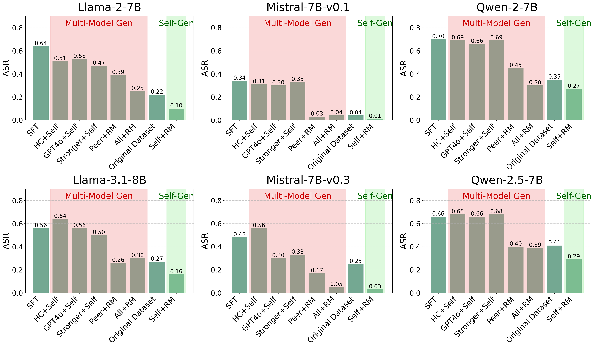

# More is Less: The Pitfalls of Multi-Model Synthetic Preference Data in DPO Safety Alignment
This repository contains the official code for the paper [More is Less: The Pitfalls of Multi-Model Synthetic Preference Data in DPO Safety Alignment](https://arxiv.org/abs/2504.02193), which investigates how different sources of synthetic preference data affect safety alignment in large language models when using Direct Preference Optimization (DPO). Our study reveals a striking, safety-specific phenomenon: while multi-model generated data enhances performance on general tasks by providing diverse responses, it also facilitates reward hacking during training, leading to higher vulnerability to jailbreak attacks. This issue is particularly pronounced when employing stronger models like GPT-4o to generate chosen responses paired with target model self-generated rejected responses. We demonstrate that multi-model preference data exhibits high linear separability between chosen and rejected responses, allowing models to exploit superficial cues rather than internalizing robust safety constraints. Our experiments across Llama, Mistral, and Qwen model families consistently show that single-model generation for both chosen and rejected pairs significantly outperforms configurations incorporating responses from stronger models in terms of safety outcomes.



## Setup

### Requirements

This project uses the [Alignment Handbook](https://github.com/huggingface/alignment-handbook) for DPO training. Follow these steps to set up the environment:

1. Clone the Alignment Handbook repository:
```bash
git clone https://github.com/huggingface/alignment-handbook.git
cd alignment-handbook
```

2. Set up the environment as described in the Alignment Handbook documentation.

3. Clone this repository:
```bash
git clone https://github.com/cacayaya/More-is-Less.git
cd More_is_Less
```

## Data Generation
 
We provide the original 50k preference data we used from [SafeRLHF](https://huggingface.co/datasets/PKU-Alignment/PKU-SafeRLHF) in the `./data`.

To generate different types of preference data, run:
```bash
CUDA_VISIBLE_DEVICES=0 python dataset.py \
    --model meta-llama/Llama-2-7b-hf \
    --output_dir ./gen-data/Llama-2-7b_generated_10k
```
This will output 3 different types of synthetic preference data in separate directories:

1. **DPO**: original DPO data from SafeRLHF
2. **Self+RM**: Using the same model to generate both chosen and rejected responses and scored by reward model(OpenAssistant/reward-model-deberta-v3-large-v2)
3. **HC+Self**: Using original chosen response paired with self-generated response as rejected


To combine any two different source data into preference dataset:
```bash
# Example 1: Combine GPT-4o responses with self-generated responses without reward model
python combine_data.py \
  --rejected_data ./gen-data/Llama-2-7b_generated_10k/HC_self \
  --chosen_data ./gen-data/gpt4o_generated_10k \
  --output_dir ./gen-data/Llama-2-7b-gpt4o-mix

# Example 2: Combine with reward model  to pick best and worst as chosen and rejected.
python combine_data.py \
  --rejected_data ./gen-data/Mistral-7B-v0.3_generated_10k/HC_self \
  --chosen_data ./gen-data/gpt4o_generated_10k \
  --output_dir ./gen-data/Mistral-7B-v0.3-gpt4o-mix-with-rm \
  --use_reward_model

# Example 3: Combine larger model responses with self-generated responses without reward model
python combine_data.py \
  --rejected_data ./gen-data/Llama-2-70b_generated_10k/HC_self \
  --chosen_data ./gen-data/Llama-2-7b_generated_10k/HC_self \
  --output_dir ./gen-data/Llama-2-70b-Llama-2-7b-mix
```

`combine_data.py` will allow you to combine more powerful models with self-gen data to form following preference datasets:

4. **GPT4o+Self**: Using GPT-4o response as chosen paired with self-generated response as rejected
We provide 10k GPT-4o generated response in the `./gen-data/gpt4o_generated_10k`, which could be used to pair the preference data.

5. **Stronger+self**: : Using Larger models’ responses as chosen paired with self-generated response as rejected

## Training with DPO

After generating preference data, you can use the Alignment Handbook for DPO training. Our research shows that the source of preference data significantly impacts safety alignment outcomes.

Key findings:
- Single-model generated data leads to better safety alignment
- Multi-model data improves general capabilities but compromises safety. Models trained with multi-model data are more vulnerable to jailbreak attacks

## Evaluation

### Jailbreak Evaluation

For jailbreak evaluation, we use the same method from [LLMs-Finetuning-Safety](https://github.com/LLM-Tuning-Safety/LLMs-Finetuning-Safety). You can utilize the code in the `eval` directory to measure the Attack Success Rate (ASR) of your models:

```bash
# Add openai_key in the utils.py first
cd eval
bash run.sh
```

### General Evaluation

For general capability evaluation, we use the [LM Evaluation Harness](https://github.com/EleutherAI/lm-evaluation-harness) to test performance on benchmarks like ARC, Hellaswag, MMLU, TruthfulQA, and Winogrande.

## References

- [Alignment Handbook](https://github.com/huggingface/alignment-handbook)
- [LM Evaluation Harness](https://github.com/EleutherAI/lm-evaluation-harness)

## Citation
If you find this useful in your research, please consider citing:

```
@misc{wang2025lesspitfallsmultimodelsynthetic,
      title={More is Less: The Pitfalls of Multi-Model Synthetic Preference Data in DPO Safety Alignment}, 
      author={Yifan Wang and Runjin Chen and Bolian Li and David Cho and Yihe Deng and Ruqi Zhang and Tianlong Chen and Zhangyang Wang and Ananth Grama and Junyuan Hong},
      year={2025},
      eprint={2504.02193},
      archivePrefix={arXiv},
      primaryClass={cs.AI},
      url={https://arxiv.org/abs/2504.02193}, 
}
```

